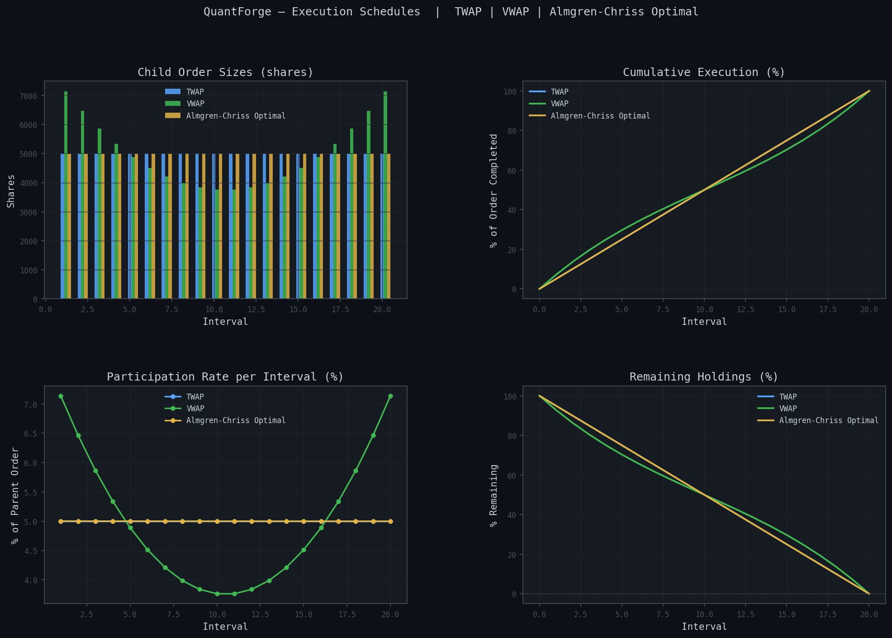
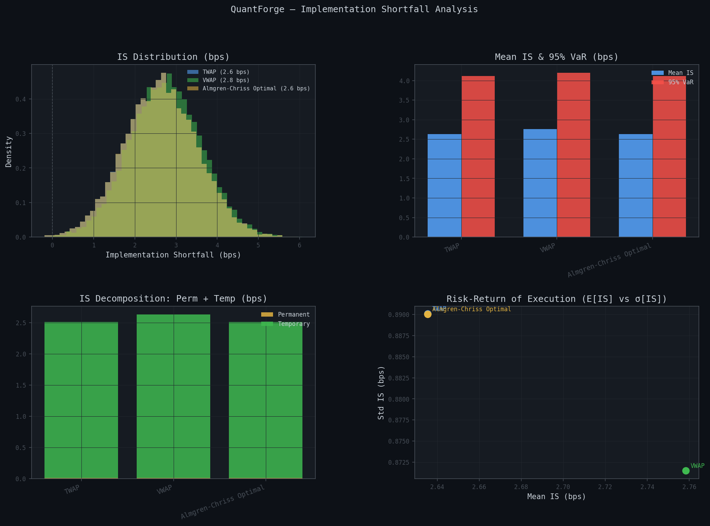
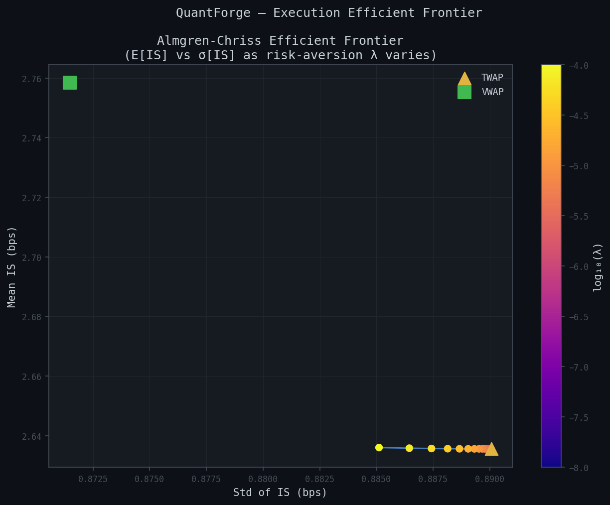

# Module 4 — Execution Simulator

> **Stack:** C++17 · Python 3.12 · pybind11 · NumPy · pandas

Optimal order execution engine based on the Almgren-Chriss (2001) framework. Computes optimal trading trajectories and estimates the implementation shortfall (IS) distribution via Monte Carlo simulation.

## Preview

| Execution schedules | IS distribution |
|:---:|:---:|
|  |  |

| Efficient frontier |
|:---:|
|  |

> Run `python 04_execution_sim/src/main.py` to generate these charts.

## Contents

| File | Description |
|------|-------------|
| `src/schedules.py` | `twap()`, `vwap()`, `almgren_chriss()` — execution schedule factories |
| `src/simulator.py` | `ExecutionSimulator` — Monte Carlo IS simulation, `ExecutionReport` |
| `src/visualizer.py` | Schedule, IS distribution, and efficient-frontier dashboards |
| `src/main.py` | End-to-end demo pipeline |
| `include/almgren_chriss.hpp` | C++ AC model, TWAP/VWAP, Monte Carlo simulation |
| `include/exec_types.hpp` | `ACParams`, `ExecutionStats`, `Schedule` structs |
| `cpp/exec_bindings.cpp` | pybind11 bindings |
| `tests/test_execution_sim.py` | 30+ unit tests |

## Mathematical Background

### Almgren-Chriss Model (2001)

Liquidate $X$ shares over $N$ intervals of width $\tau$. Market impact:

- **Permanent** ($/share per trade): $\Delta p_k^\text{perm} = \gamma\, n_k$
- **Temporary** (execution premium): $\Delta p_k^\text{temp} = \eta\, (n_k / \tau)$

Expected cost and variance:

$$\mathbb{E}[\text{cost}] = \frac{\gamma}{2}X^2 + \frac{\eta}{\tau}\sum_{k=1}^N n_k^2$$

$$\text{Var}[\text{cost}] = \sigma^2 \tau \sum_{k=1}^N x_k^2$$

**Objective:** minimise $\mathbb{E}[\text{cost}] + \lambda\,\text{Var}[\text{cost}]$

### Optimal Trajectory

$$x_k = X \cdot \frac{\sinh\!\bigl(\kappa(N-k)\tau\bigr)}{\sinh(\kappa N\tau)}, \qquad \kappa = \sqrt{\frac{\lambda\sigma^2}{\tilde\eta}}, \quad \tilde\eta = \eta - \frac{\gamma\tau}{2}$$

Trade sizes: $n_k = x_k - x_{k+1}$.

**Limiting cases:**
- $\lambda \to 0$ (risk-neutral): $x_k \to X(N-k)/N$ — uniform TWAP
- $\lambda \to \infty$ (infinitely risk-averse): immediate liquidation

### Implementation Shortfall

$$\text{IS} = \frac{1}{X}\sum_{k=1}^N n_k\, p_k^\text{exec} - p_0$$

Decomposed into permanent impact, temporary impact, and timing risk.

### VWAP Schedule

Participates proportionally to a U-shaped intraday volume profile:

$$n_k = X \cdot \frac{v_k}{\sum_j v_j}, \quad v_k = 0.5 + 2\left(\frac{k}{N} - 0.5\right)^2$$

### Efficient Frontier

By sweeping the risk-aversion parameter $\lambda$, we trace an efficient frontier in $(\mathbb{E}[\text{IS}], \sigma[\text{IS}])$ space — analogous to Markowitz for portfolio allocation.

## Project Structure

```
04_execution_sim/
├── README.md
├── setup.py              # C++ extension build (pybind11, C++17)
├── include/
│   ├── exec_types.hpp    # ACParams, ExecutionStats, Schedule structs
│   └── almgren_chriss.hpp  # AC model, TWAP, VWAP, MC simulation
├── src/
│   ├── schedules.py      # Execution schedule factories
│   ├── simulator.py      # Monte Carlo simulator, ExecutionReport
│   ├── visualizer.py     # Matplotlib dashboards
│   └── main.py           # Runnable demo
├── cpp/
│   └── exec_bindings.cpp # pybind11 bindings
└── tests/
    └── test_execution_sim.py
```

## Quick Start

```python
from schedules import twap, vwap, almgren_chriss
from simulator import ExecutionSimulator, compare_schedules

# Market parameters
X, N = 100_000, 20
sigma, eta, gamma, lam, tau = 0.015, 2.5e-7, 2.5e-8, 1e-6, 1/20

# Build schedules
sched_twap = twap(X, N)
sched_vwap = vwap(X, N)
sched_ac   = almgren_chriss(X, sigma=sigma, eta=eta, gamma=gamma,
                             lam=lam, N=N, tau=tau)

# Simulate IS distribution
sim = ExecutionSimulator(sigma=sigma, eta=eta, gamma=gamma, tau=tau,
                          arrival_price=100.0, n_paths=10_000)

report = sim.simulate(sched_ac)
print(report)                    # Mean IS, Std, 95% VaR/CVaR, decomposition

# Compare all schedules
df = compare_schedules(sim.simulate_multiple([sched_twap, sched_vwap, sched_ac]))
print(df)
```

## Build C++ Extension

```bash
cd 04_execution_sim
pip install pybind11
python setup.py build_ext --inplace
```

The module falls back to pure NumPy if the extension is not compiled.

## Run the Demo

```bash
python 04_execution_sim/src/main.py
```

## Run Tests

```bash
# From the project root
pytest 04_execution_sim/tests/ -v
```

## References

- Almgren, R. & Chriss, N. (2001). *Optimal Execution of Portfolio Transactions*. Journal of Risk, 3(2), 5–39.
- Almgren, R. (2003). *Optimal Execution with Nonlinear Impact Functions and Trading-Enhanced Risk*. Applied Mathematical Finance, 10(1), 1–18.
- Kissell, R. (2006). *The Expanded Implementation Shortfall: Understanding Transaction Cost Components*. Journal of Portfolio Management.
